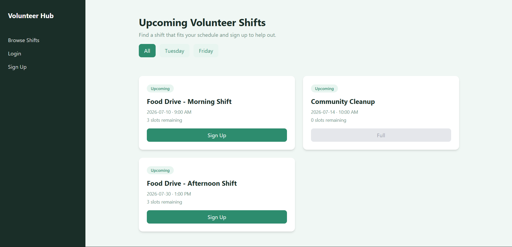
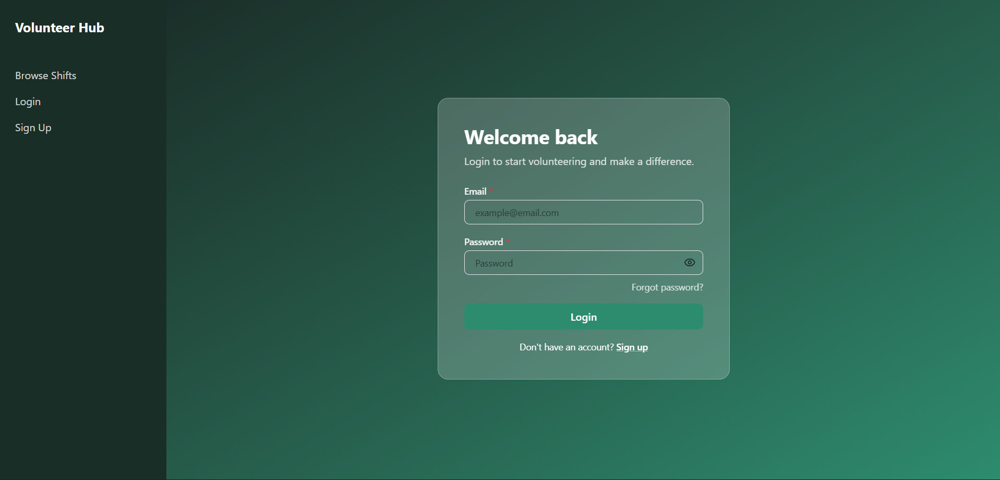
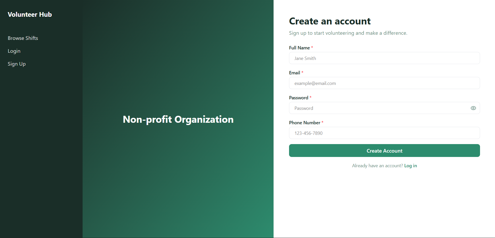
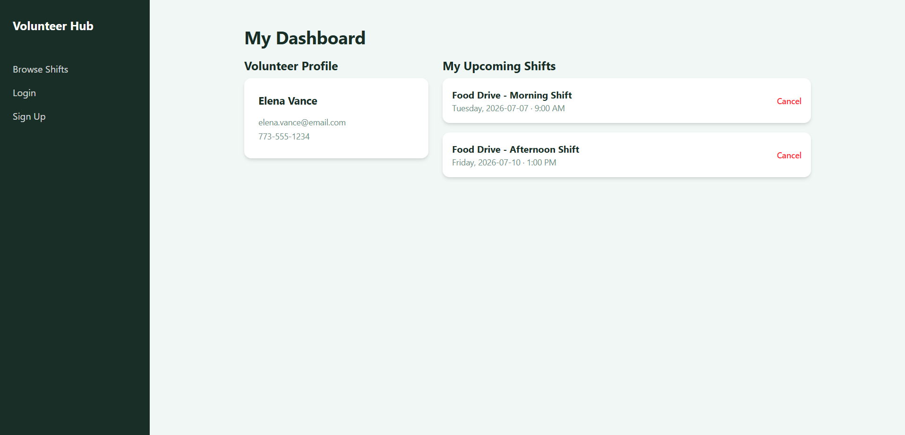
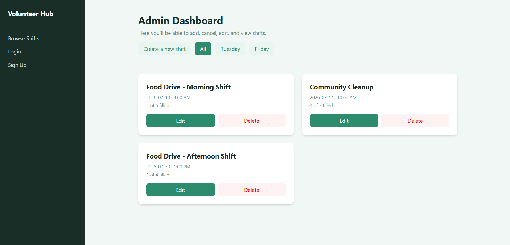
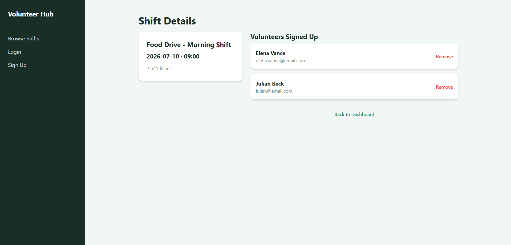

# Volunteer Hub

A volunteer shift sign-up app built for a real non-profit organization. Volunteers can browse and sign up for upcoming shifts, while admins can create, edit, and manage shifts and volunteers.

Built as a portfolio project to demonstrate multi-role authentication, protected routing, real-world UX decisions, and accessible UI design.

---

## Tech Stack

- **React 18** with Vite
- **Tailwind CSS v4**
- **React Router v6**
- **Supabase** _(planned — auth, database, RLS)_
- **Lucide React** for icons
- **Deployed on Vercel**

---

## Features

### Public (no login required)

- Browse upcoming volunteer shifts
- Filter shifts by day (Tuesdays / Fridays)
- Loading skeleton state and empty state handling

### Volunteer (logged in)

- Sign up for available shifts
- View upcoming signed-up shifts on personal dashboard
- Cancel a shift sign-up with confirmation

### Admin (logged in, admin role)

- Create new volunteer shifts
- Edit existing shifts with pre-filled form
- Delete shifts with confirmation
- View shift detail page showing signed-up volunteers
- Remove a volunteer from a shift

---

## Architecture Decisions

**Multi-role routing**: Two separate route guards (`ProtectedRoute` and `AdminRoute`) handle access control. Volunteers are redirected away from admin pages; unauthenticated users are redirected to login. This was a deliberate choice over a single combined guard to keep each component's responsibility clear.

**UI-first development**: The entire UI was built with fake data before connecting Supabase. This allowed validating component structure, routing logic, and UX flows independently of backend concerns. Supabase integration follows the same patterns already demonstrated in [AutoShop Tracker](https://autoshop-tracker-khaki.vercel.app/).

**Reusable utility functions**: Date parsing logic lives in `lib/dateHelper.js` rather than inline in components. This solved a real timezone offset bug (ISO date strings parsed via `new Date()` shift by one day in local timezones) and made the fix reusable across `BrowseShifts`, `MyShifts`, and `AdminDashboard`.

**Component separation**: `EmptyState` and `SkeletonCard` are extracted into reusable components with props, used across multiple pages with different messaging. `ProtectedRoute` and `AdminRoute` are wrapper components rather than inline conditionals, keeping route definitions readable.

**Fake data shaped like real queries**: Fake data in `MyShifts` and `ShiftDetail` mirrors the nested structure a real Supabase join would return (`signup` → `shift`, `signup` → `volunteer`). This means wiring up real data later requires minimal restructuring.

**Accessibility throughout**: Every page includes ARIA roles, labels, and keyboard navigation. Forms use `htmlFor`/`id` associations, error banners use `role="alert"`, lists use `role="list"`/`role="listitem"`, and interactive non-button elements include `tabIndex` and `onKeyDown` handlers.

---

## Pages

| Page                | Route                                        | Access    |
| ------------------- | -------------------------------------------- | --------- |
| Browse Shifts       | `/`                                          | Public    |
| Login               | `/login`                                     | Public    |
| Sign Up             | `/signup`                                    | Public    |
| My Dashboard        | `/my-shifts`                                 | Volunteer |
| Admin Dashboard     | `/admin`                                     | Admin     |
| Create / Edit Shift | `/admin/shifts/new` `/admin/shifts/:id/edit` | Admin     |
| Shift Detail        | `/admin/shifts/:id`                          | Admin     |

---

## Project Structure

```text
├── assets/ # Documentation assets (screenshots)
│   └── admin.png
    └── browse-shifts.png
    └── login.png
    └── my-shifts.png
    └── shift-details.png
    └── signup.png
src/
├── components/ # Reusable UI (EmptyState, SkeletonCard, ProtectedRoute, AdminRoute, Navbar)
├── context/ # AuthContext — user and role state
├── hooks/ # Custom hooks (future use)
├── lib/ # Utility functions (dateHelper.js)
└── pages/
    ├── public/ # BrowseShifts, Login, Signup
    ├── volunteer/ # MyShifts
    └── admin/ # AdminDashboard, CreateShift, ShiftDetail
```

---

## What's Next

- **Supabase integration**: Auth, database tables (`profiles`, `shifts`, `signups`), and RLS policies restricting data access by role
- **Real-time updates**: Supabase Realtime to reflect slot counts without page refresh
- **Email notifications**: Notify volunteers of shift reminders or cancellations via Resend
- **Google/Apple OAuth**: Social login via Supabase OAuth providers
- **Potential deployment**: Working with the non-profit organization this was designed for

---

## Local Development

```bash
git clone https://github.com/whaleism/volunteer-signup-app
npm install
npm run dev
```

---

## Screenshots

**Browse Shifts**



**Login Page**



**Signup Page**



**My Shifts - Volunteers**



**Admin Dashboard**



**Shift Details - Admins**


